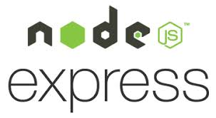

## Aula 1- Versionamento 

### Meu Exercício
---
# Frameworks para Back-End :computer:

## O que é um Framework?

 O framework é um pacote de códigos prontos que podem ser utilizados no desenvolvimento de sites. A proposta de uso dessa ferramenta é aplicar funcionalidades, comandos e estruturas já prontas para garantir qualidade no projeto e produtividade.

### :floppy_disk:  Frameworks não são Banco de dados 

 Frameworks não são banco de dados, na verdade, na verdade seu uso é pontual e voltado para o processo de criação do site.

## Frameworks para Back-End

 Confira os frameworks mais utilizados para Back-End, conforme pesquisa realizada entre programadores.<p.>

1. ### Spring

Com uma estrutura Model-View-Controller em Java, esse framework possui muitos projetos que tornam o seu desempenho ainda maior. Indicado para quem domina a linguagem JAVA.

2. ### Express

esse framework tem se tornando um dos mais famosos entre os desenvolvedores web, devido ao Node.js e é baseado em estruturas mínimas